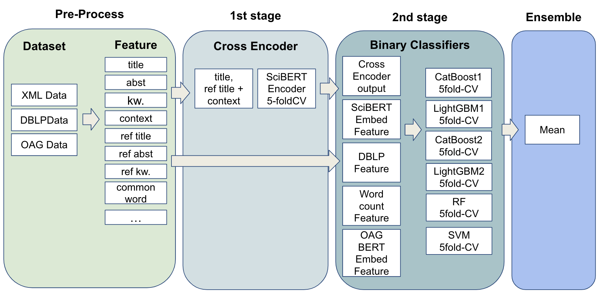

# KDDCUP 2024 OAG-Challenge PST ~~9th~~ 8th solution NTTDOCOMOLABZ

This repository is the team NTTDOCOMOLABZ's solution for [KDDCUP 2024 OAG-Challeng Task 3 PST](https://www.biendata.xyz/competition/pst_kdd_2024/). We achieved 9th place in the conpetition. (and finally 8th place). Overview of our solution is shown as follows.

## Authors

- NTTDOCMOLABZ
  - masatoh 
  - K.O. 
  - yukko08

## Solution Overview

We adopted a two-stage approach to address the competition task. In the first stage, we employed a cross-encoder model integrated with SciBERT to determine whether the source paper is among the most significant references. In the second stage, we utilized the features derived from both the target and source papers, along with the output from the first stage, to feed into several binary classifiers for prediction. Finally, we aggregated the results of these classifiers using an ensemble method to enhance the overall accuracy and robustness of our solution.



## Requires
- Linux (Our team used Amazon linux 2)
- CUDA 12.1.0

## Environment setup
```
$ docker compose up -d
$ docker exec -it kdd2024-pst /bin/bash
$ <Inside-container> poetry install
```

## Dataset
- Provided PST dataset available at the [competion page](https://www.biendata.xyz/competition/pst_kdd_2024/data/)
  - https://www.dropbox.com/scl/fi/namx1n55xzqil4zbkd5sv/PST.zip?rlkey=impcbm2acqmqhurv2oj0xxysx&dl=1
  - https://open-data-set.oss-cn-beijing.aliyuncs.com/oag-benchmark/kddcup-2024/PST/PST-test-public.zip

We used paper attribute datasets that are permited for use in this competion, as described [here](https://www.biendata.xyz/competition/pst_kdd_2024/data/)

- DBLP dataset
  - DBLP-Citation-network V15 available at [here](https://open.aminer.cn/open/article?id=655db2202ab17a072284bc0c).
  
- OAG dataset 
  - OAG V3.1 dataset Publication data available at [here](https://open.aminer.cn/open/article?id=5965cf249ed5db41ed4f52bf)
     - publication_1.zip ~ publication_14.zip

Please put the downloaded data at a `dataset` directory

## Directory structure
Files in the `dataset` directory are shown below.

```
.
├── DBLP-Citation-network-V15.json
├── OAG
│   ├── v3.1_oag_publication_1_00.gz
│   ├── v3.1_oag_publication_1_00.json
│   ├──  .......
│   └── v3.1_oag_publication_14.json
└── PST
    ├── paper-xml
    │   ├── 53e99792b7602d9701f57e77.xml
    │   ├── 53e99796b7602d9701f5d380.xml
    │   ├── 6584f922939a5f408236fc36.xml
    │   ├──  ........
    │   └── 65922fe2939a5f40826ca612.xml
    ├── paper_source_gen_by_rule.json
    ├── paper_source_trace_test_wo_ans.json
    ├── paper_source_trace_train_ans.json
    ├── paper_source_trace_valid_wo_ans.json
    ├── submission_example_test.json
    └── submission_example_valid.json 
```

#### Note 
- The original OAG dataset is divided into small size dataset because we execute the code on a limited memory in our implementation by using the following command.
```
$ split -l 1000000 -d --additional-suffix=.json v3.1_oag_publication_X.json v3.1_oag_publication_X_ 
```
- "context\_feature" indicates train_context.csv and test_pub_context.csv.


## Pre-process 
```
$ <Inside container /works>
$ cd preprocess
```

Extracts data from the DBLP dataset. 

```
$ poetry run python process_kddcup_data.py
```

Parses XML files from the provided train, validation, and test datasets as well as the DBLP dataset to extract titles, abstracts, keywords, organizations, venues, context, etc.

```
$ poetry run pytohn xml_parser.py
```

Generates paper titles for missing values in the test dataset for the final submission.

```
$ poetry run python oagbert_title_gen.py
```

#### Feature generation (Fill context feature)
Fill paper information using [Open Academic Graph](https://open.aminer.cn/open/article?id=5965cf249ed5db41ed4f52bf). Before executing the following notebook, please download OAG dataset from [Open Academic Graph](https://open.aminer.cn/open/article?id=5965cf249ed5db41ed4f52bf). 

```
Fill_paper_info_by_OAG.ipynb
```

## First stage (train and test prediction)
Executes the cross-encoder model using the sentence-transformers library. We use the SciBERT model with 5-fold cross-validation using GroupKFold.
```
$ <Inside container /works>
$ cd first_stage
$ poetry run python cross_encoder.py --ubm --output_dir ../ce/default --train --prediction
```

## Second stage

```
$ <Inside container /works>
$ cd second_stage
```

### DBLP based feature
Creates paper metadata features using the DBLP dataset and XML files. This script is based on the public baseline code available at https://github.com/THUDM/paper-source-trace/blob/main/rf/process_data.py

```
$ poetry run python dblp_feature.py
```

And modified version of dblp_feature.py

```
$ poetry run python dblp_feature2.py
```

### SciBERT-encode based feature

Performs SciBERT encoding for each sentence of the title, abstract, keywords, organization, venue, context, and so on, which are outputs from xml_parser.py. It also calculates cosine similarities between the target paper and the source paper using each feature.  
```
$ poetry run python scibert_encode_3.py
```

### OAGBERT based feature

Calculate OAG-BERT-based cosine similarity feature after filling context featureb using the following notebook.
```
OAGBERT_embedding_cossim.ipynb
``` 

Encodes papers using the OAGBERT model and calculates the cosine similarity between the target and source papers. This script creates another version of OAGBERT feature.
```
$ poetry run python oagbert.py 
```

### Generate Feature 

Run following notebook to format features.  

```
feature_generate4.ipynb
```

```
feature_generate5_feature_without_emb.ipynb
```

```
feature_generate6_with_oag.ipynb
feature_post_process.ipynb
```

Now, we have the following 4-types of features in the `output` directory.
- output/0601
- output/dblp_title_2_oag
- output/dblp_title_2_oag_clean
- output/feat_without_emb

### Run classifieres (train and test prediction)

Excecutes binary classification models. CatBoost, LightGBM,  RandomForest and SVM.Implements 5-fold cross-validation using GroupKFold.
Here, we train 6 models. 2 CatBoost, 2 LightGBM, 1 RandomForest, and 1 SVM.

```
$ poetry run python classifier.py --model_name catboost_0 --input_dir ../output/0601/ --trial_name catboost_0
$ poetry run python classifier.py --model_name lightgbm_binary --input_dir ../output/0601/ --trial_name lgbm_binary
$ poetry run python classifier.py --model_name random_forest --input_dir ../output/0601/ --trial_name rf
$ poetry run python classifier.py --model_name svm --input_dir ../output/feat_without_emb --trial_name svm_feat_without_emb --fill
$ poetry run python classifier_weight.py --model_name catboost_0 --input_dir ../output/dblp_title_2_oag_clean/ --trial_name catboost_0_dblp_2_clean
$ poetry run python classifier_weight.py --model_name lightgbm_binary --input_dir ../output/dblp_title_2_oag_clean/ --trial_name lgbm_dblp_2_clean
```

## Ensemble
Run the following notebook to ensemble the results of the classifiers.
```
ensemble_oag_clean.ipynb
```

Now we have the final submission file in the `submit` directory.

## Checkpoints
The output of the pre-process is data.zip.
The checkpoints of the first stage are ce.zip-0 ~ ce.zip-5.
Because the file size is large, I split it using the split command
```
split -b 500M -d ce.zip ce.zip-
```

The output file of the second stage is classifier_output.zip.